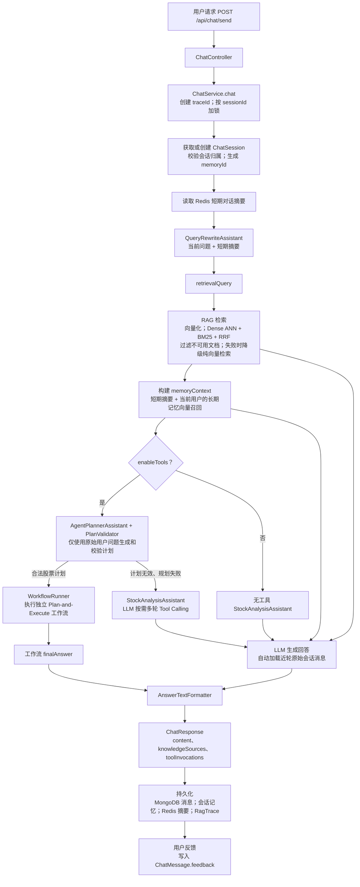
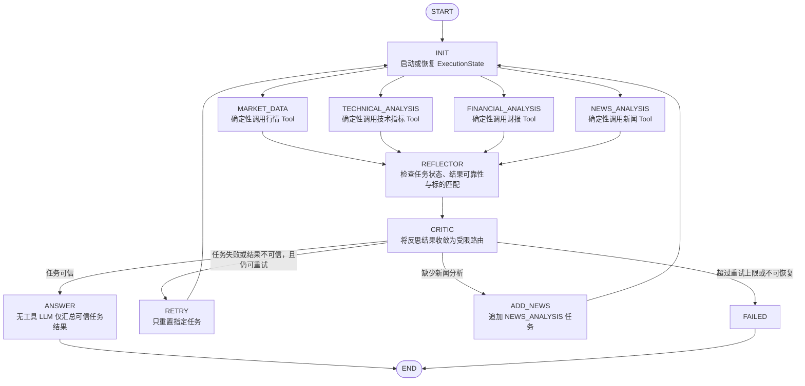

# Stock Insight Agent

基于 Java 21 + Spring Boot 3 + LangChain4j 构建的股票研究 Agent。核心是用 LangGraph4j `StateGraph` 实现的可持久化、可恢复 Plan-and-Execute 工作流，并用 Milvus 2.5 Hybrid Search（稠密向量 + BM25 + RRF）驱动检索增强问答。

## 核心能力

- 实时行情、技术指标（MA/MACD/RSI/KDJ/布林带）、财务基本面（营收/净利润/ROE/PE/PB/现金流）分析
- 新闻/公告/研报 RAG 检索，多股票对比与投资组合分析
- 对接外部预测服务生成股票趋势预测
- 递归短期记忆（Redis 原始窗口 + LLM 滚动摘要）+ 长期记忆（用户主动录入 + 语义召回）+ 查询重写

## 技术栈

Java 21、Spring Boot 3.3、LangChain4j 1.0.0-beta3、LangGraph4j 1.6.1、MongoDB（Spring Data）、Redis、Milvus 2.5（Java SDK 2.5.7）、阿里云百炼、前端 React + Vite。

## Agent 划分

系统不是一个模型顶所有事，而是按职责拆成五个独立的 `AiServices` 实例，各自绑定不同的 System Prompt 和工具权限，互不干扰：

| Agent | 接口 | 工具权限 | 职责 |
|-------|------|----------|------|
| 规划器 | `AgentPlannerAssistant` | 无 | 只把用户问题转成 `{intent, symbol, tasks}` JSON 候选计划，自身不能触发任何副作用 |
| 全功能研究助手 | `StockAnalysisAssistant`（`stockAnalysisAssistant`） | 全部 7 个业务 Tool | Planner 判定不是股票分析问题、或计划被 `PlanValidator` 拒绝时的兜底路径，模型自主决定调用哪些工具 |
| 工作流内回答生成器 | `StockAnalysisAssistant`（`stockAnalysisAssistantWithoutTools`） | 无 | 同一接口的无工具变体，只在图工作流的 ANSWER 节点被调用，只消费 Critic 已验证的任务结果 |
| 查询重写器 | `QueryRewriteAssistant` | 无 | 结合短期摘要把追问改写成独立可检索的问句，只服务 RAG 和长期记忆召回 |
| 对话摘要器 | `ConversationSummaryAssistant` | 无 | 将已有摘要与即将淘汰的早期消息递归压缩，保留关键事实、约束、结论与待办 |

这五个 Agent 由 `AgentConfig` 统一构建，同一个 `chatLanguageModel` 后端，靠 System Prompt 和工具集合区分角色，而不是靠模型自己在一份 Prompt 里判断"这次该不该用工具"。

## 架构亮点

### 1. 图原生工作流：把 Plan-and-Execute 编成一张真实的图

`StockAnalysisWorkflow` 用 LangGraph4j `StateGraph` 显式声明节点和边：`INIT → 四个任务节点（并行）→ REFLECTOR → CRITIC → RETRY/ADD_NEWS/ANSWER/FAILED`。CRITIC 节点返回 `Command`，携带下一跳路由名，图引擎据此跳转。图结构本身就是流程文档，任务节点、复盘节点、裁决节点、终态节点各自的职责边界在编译期就固定下来。

### 2. 有环图：支持多轮自我纠正，不是一次性流水线

图不是单向 DAG：`graph.addEdge("RETRY", "INIT")` 和 `graph.addEdge("ADD_NEWS", "INIT")` 把 CRITIC 的两条路由绕回起点，让任务节点重新展开执行。发现某个任务结果不可信，或者缺了新闻分析，工作流会自己再跑一轮，而不是把半成品结果直接扔给回答阶段。循环由 `WorkflowRetryPolicy`（默认 8 次）兜底，任务级 `attempts` 计数保证循环有限终止，不会无限绕圈。

### 3. Fan-out/Fan-in 并行任务

行情、技术、财务、新闻四类分析被建模为四个独立的图节点，从 `INIT` 同时展开，各自维护状态机（`PLANNED → RUNNING → COMPLETED/FAILED/RETRYING`）、尝试次数、结果和错误信息，在 `REFLECTOR` 节点汇合。单个任务失败不影响其他任务继续跑完，复盘阶段统一决策。

### 4. MongoDB Checkpoint + 乐观锁 + 幂等恢复

`ExecutionState` 整体持久化到 `agent_execution_states`，每次落盘都带版本号：`MongoExecutionStateStore` 用 `findAndReplace` 配合 `version` 条件更新，版本不匹配直接抛 `CheckpointConflictException`，避免旧状态覆盖新状态。`WorkflowRunner.resume(executionId)` 能从任意中断点恢复执行——因为节点执行前会检查任务当前状态，已经 `COMPLETED` 的任务直接跳过，不会重复调用 Tool 或重新计费。

### 5. Reflector + Critic：把"结果可信吗"从模型手里拿回来

`WorkflowReflector` 用确定性规则逐个检查任务结果：状态是否 `FAILED`、内容是否命中"失败/异常/ERROR"关键词、返回的标的代码是否和计划里的 `symbol` 一致。不可信且还有重试次数的任务标记重试；超过 `WorkflowRetryPolicy`（默认 8 次）上限的标记终态失败；如果所有任务都通过校验但缺了新闻分析，会动态追加一个 `NEWS_ANALYSIS` 任务。`WorkflowCritic` 再把这份复盘结论收敛成四选一的路由（`RETRY`/`ADD_NEWS`/`ANSWER`/`FAILED`）——判断结果是否可信这件事完全交给规则代码，不让 LLM 用自然语言"觉得还行"就把没验证过的数据放进最终回答。

### 6. 无工具 Answer Generator：回答阶段不能再调用工具

`WorkflowAnswerGenerator` 生成最终回答时用的是 `stockAnalysisAssistantWithoutTools`——同一个 `StockAnalysisAssistant` 接口，但构建时没有注册任何 `@Tool`。这是有意为之：ANSWER 节点只应该在 Critic 判定"结果可信"之后才会被路由到，此时四类任务已经拿到经过 Reflector 校验的结果，回答阶段的唯一任务是把这些已验证的数据组织成结论，而不是重新决定要不要再查一次行情或再搜一次新闻。如果这一步还带着 Tool，模型完全可能在生成回答时绕开 Critic 的裁决，自己动手调用工具拿一份未经校验的数据放进答案，等于让图编排的可信性保证形同虚设。传入的 prompt 也只包含 `state.getOriginalQuestion()` 和拼接好的任务结果文本，模型只能基于这份白名单内的上下文做总结，构不成额外的信息来源。

### 7. Planner + PlanValidator：模型只提议，代码才有决定权

`AgentPlannerAssistant` 是一个不注册 Tool 的纯规划助手，只输出 `{intent, symbol, tasks}` 结构，本身不能触发任何 Tool 调用或副作用。这份计划必须先经过 `PlanValidator` 校验才能进入执行层：意图必须精确等于 `STOCK_ANALYSIS`；股票代码要么已经是 `\d{6}.(SH|SZ|BJ)` 格式，要么是纯 6 位数字并能按开头数字规则推导出交易所后缀，推导不出来直接判非法；任务列表不能为空、不能包含非法枚举值，并做去重。任何一项没通过，计划就地拒绝，回退到不受计划约束的完整工具助手，而不是把模型的原始输出直接交给执行器。当模型输出 Markdown 或夹带解释文字而不是纯 JSON 时，`PlannerTextParser` 会尝试从文本里抽取股票代码和任务关键词，抽取出的候选依然要过同一套 `PlanValidator` 校验——多一层文本兜底，不代表放宽校验标准。

### 8. Tool 调用不是简单的 LLM function calling 包装

七个业务 Tool（`MarketDataTool`/`TechnicalAnalysisTool`/`FinancialAnalysisTool`/`NewsRagTool`/`TimeSeriesPredictionTool`/`StockComparisonTool`/`PortfolioAnalysisTool`）统一返回 `ToolResult<T>`（`success`/`data`/`errorCode`/`errorMessage`/`costTime`），异常在 Tool 内部被捕获转成结构化失败，不会作为未处理异常向上抛到框架的工具调用循环里。`predictStockTrend` 用 JDK `HttpClient` 同步调用外部 `daily_stock_analysis` 分析流水线（`POST /api/v1/analysis/analyze`），带独立超时配置，把嵌套的 `report.summary.trend_prediction` 结构拍平成 Tool 输出。`AgentConfig.selectTools` 按名称从统一的工具注册表里挑选子集，同一批 Tool 实现同时服务于两条路径：普通对话走 LangChain4j `AiServices` 的自动 function calling（模型自主决定调用哪个、调几次），股票分析工作流则走 `StockAnalysisTaskExecutor` 的确定性映射（图节点指定任务类型，直接调用对应方法，不经过模型二次判断）——同一套 Tool 既能被模型自由调度，也能被工作流强制编排。

### 9. 工具调用循环上限与可控降级

`AgentToolConfig.maxSequentialInvocations`（默认 10）把 LangChain4j 默认 100 次的连续工具调用上限收紧，模型陷入反复调错工具、结果不收敛时提前失败，而不是空转到框架默认值才报错。`ChatService` 捕获到工具调用超限或连接异常后，会清空该会话在 LangChain4j 里的记忆，避免下一轮请求在同一个发散的消息序列上继续叠加。

### 10. Milvus 2.5 Hybrid Search + RRF 融合检索

知识库 collection（`MilvusHybridCollectionManager`）在稠密向量字段之外，用 Milvus 2.5 的 BM25 Function 从 `content` 字段自动生成稀疏向量字段，两者共存于同一张表。检索时 `MilvusHybridSearchClient` 并发构建两个 `AnnSearchReq`（COSINE 稠密 ANN + BM25 稀疏 ANN），交给 `HybridSearchReq` 和 `RRFRanker(60)` 做倒数排名融合，一次调用拿到融合后的 Top-K，比单纯依赖 Embedding 相似度更抗关键词漂移和语义漂移的双重风险。`RetrievalService` 在 Hybrid 客户端不可用或调用异常时自动降级为纯语义检索，检索链路不会因为 Milvus Function 未启用而整体不可用。

### 11. 查询重写：让多轮追问也能被检索命中

每轮对话先把用户当前问题和 Redis 里的短期对话摘要一起交给 `QueryRewriteAssistant`（无记忆、无工具的独立 LLM 调用），改写成不依赖上下文就能独立检索的问句。改写结果只用于 RAG 检索和长期记忆召回，最终回答仍然基于用户的原始问题生成——避免"这个的估值怎么样"这类指代不明的追问在向量检索时召回不到内容，同时不让改写引入的措辞变化污染最终回答的语气。

### 12. 全链路诊断日志：一次请求可追到模型、工具和工作流

`ChatService` 为每个对话请求生成 `traceId`，并通过 MDC 关联会话准备、查询重写、RAG、规划、执行和回答日志；进入工作流后，`ExecutionState` 持久化该标识，`WorkflowRunner.resume(executionId)` 恢复执行时仍可沿用同一条链路。`TracingChatLanguageModel` 包装所有 `ChatLanguageModel` 调用，记录模型请求、响应、耗时与异常；工作流节点和 Tool 执行同时记录路由、重试、输入、结构化结果和耗时。因此可结合 `traceId`、`sessionId`、`executionId` 定位一次 Plan-and-Execute 的完整过程，而不改变原有执行分支。

## 执行链路



主链路中的 RAG 与长期记忆是串行执行：短期摘要先用于查询重写，再依次完成 RAG 和长期记忆召回。Planner 不消费这些上下文，只根据原始用户问题提出候选计划；普通 Agent 回答路径才同时注入 RAG、短期/长期记忆和近轮原始会话消息。

### Plan-and-Execute 工作流



工作流会根据本轮任务结果决定是否再次调用工具，但该决定不是 Answer 阶段的 LLM 自主发起：`WorkflowReflector` 以确定性规则检查失败、空结果、错误关键词和标的匹配，`WorkflowCritic` 只允许路由到 `RETRY`、`ADD_NEWS`、`ANSWER` 或 `FAILED`。`RETRY` 与 `ADD_NEWS` 回到 `INIT` 后重新执行需要的任务，经过再次校验后才允许生成最终回答。

工作流核心代码位于 `src/main/java/com/ljl/ai/workflow/`：

- `StockAnalysisWorkflow`：定义 LangGraph4j 节点和边
- `StockAnalysisTaskExecutor`：任务到业务 Tool 的唯一映射入口
- `WorkflowReflector` / `WorkflowCritic`：复盘任务结果并裁决下一步路由
- `WorkflowAnswerGenerator`：基于可信结果生成最终答案
- `MongoExecutionStateStore`：MongoDB Checkpoint 与乐观锁版本控制
- `WorkflowRunner`：新建执行、调用 StateGraph、按 `executionId` 恢复

## 记忆体系

- **短期记忆：保持一次会话的连续性**。LangChain4j `MessageWindowChatMemory` 落地到 Redis List（`ai:memory:messages:{userId}:{sessionId}`），默认保留最近 20 条原始消息，包含用户消息、AI 回复和完整工具调用链。超过字符上限（默认 32,000）后，`ShortTermSummaryService` 将“已有摘要 + 即将淘汰的前半窗口消息”交给 `ConversationSummaryAssistant` 生成新的递归摘要，并只保留后半窗口的最新原文。摘要保存于独立的 `ai:memory:summary:{userId}:{sessionId}`，不会被窗口覆盖；生成失败、为空或超过摘要预算时，原始窗口不会被淘汰。
- **上下文注入：让模型同时看懂远近历史**。每轮主对话都收到 Redis 中的近轮原文、系统消息中的短期摘要和当前用户原始问题；摘要不会拼进用户消息，因此不会随着下一轮再次写入 Redis。RAG 对话同样携带这份历史上下文。查询重写器利用短期摘要把“它最近怎么样”这类追问改写成可独立检索的问题。
- **长期记忆：跨会话保留用户明确授权的信息**。用户通过前端或 `/api/memories` 主动录入的偏好、约束或长期背景，其原文和标签存 MongoDB `user_long_term_memories`，向量存 Milvus 并带 `userId`/`memoryId` 元数据。召回时先按相似度检索出候选池（Top-K 的 100 倍作为候选，因为向量库是多用户共享的），再按 `userId` 和启用状态过滤，避免用户之间的记忆互相串用；它与短期摘要共同作为系统上下文提供给模型。
- **RAG 知识库**：`KnowledgeService` 处理文档分块、Embedding、双写 Milvus 单路存储和 Hybrid collection（支持BM25与语义搜索的collection)，同时把文档元数据、来源、启用状态存进 MongoDB `knowledge_documents`。删除/禁用文档时先在 MongoDB 打删除中标记，再带重试地删除向量，最后才移除记录，防止向量删除失败导致 MongoDB 记录和向量库状态不一致。支持飞书文档同步，同步时用乐观锁处理并发写入冲突。

## 启动

环境要求：JDK 21、Maven、MongoDB、Redis；Milvus 用于知识库检索，未启动不影响基础对话服务启动。

```bash
mvn spring-boot:run
```

默认服务地址 `http://localhost:8080`，健康检查 `GET /api/health`。

前端（`frontend/`，React + Vite）：

```bash
cd frontend
npm install
npm run dev
```

默认访问 `http://localhost:5173`，接口代理到后端 8080。前端支持用户/会话/股票代码设置、历史会话加载、RAG 和 Tool 调用开关、长期记忆主动录入，以及工具调用结果、知识来源和响应耗时展示。

诊断日志默认记录完整模型与工具内容；生产环境可通过 `TRACE_LOGGING_MAX_CONTENT_LENGTH`（对应 `trace.logging.max-content-length`）限制单条记录长度，`0` 表示不截断。日志可能包含用户问题、检索上下文和工具结果，应按受控诊断环境与日志保留策略处理。

对话接口示例：

```bash
curl -X POST http://localhost:8080/api/chat/send \
  -H "Content-Type: application/json" \
  -d '{"userId":"demo-user","message":"分析贵州茅台最近的走势","orderId":"600519.SH","enableRag":true,"enableTools":true}'
```

- `enableTools=true`：先生成并校验计划；合法股票计划进入 LangGraph4j Plan-and-Execute 工作流，计划无效或规划失败时降级为支持自主 Tool Calling 的 Agent；`false` 时使用不注册 Tool 的普通对话 Agent。
- `enableRag=true`：先从 Milvus 检索知识再注入上下文；`false` 时跳过检索。

## REST API

| 方法 | 路径 | 说明 |
|------|------|------|
| `POST` | `/api/chat/send` | 发送对话消息，可控制 `enableRag`、`enableTools` |
| `GET` | `/api/chat/sessions/{sessionId}/messages` | 获取会话历史 |
| `GET` | `/api/chat/users/{userId}/sessions` | 获取用户会话列表 |
| `POST` | `/api/chat/messages/{messageId}/feedback` | 提交消息反馈 |
| `POST` | `/api/memories` | 新增用户长期记忆 |
| `GET` | `/api/memories/recall` | 按语义相似度召回长期记忆 |
| `DELETE` | `/api/memories/{memoryId}` | 删除用户自己的长期记忆 |
| `POST` | `/api/rag/search` | 指定 `topK` 的语义/混合检索 |
| `POST` | `/api/rag/query` | RAG 增强查询，失败时降级为普通查询 |
| `POST` | `/api/knowledge/documents` | 添加知识文档 |
| `POST` | `/api/knowledge/feishu/sync` | 同步飞书文档 |
| `GET` | `/api/health` / `/api/info` | 健康检查与服务信息 |

所有预测结果仅用于研究分析，不构成投资建议。
