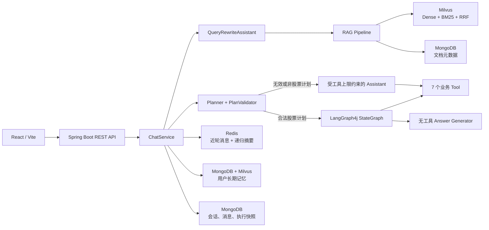
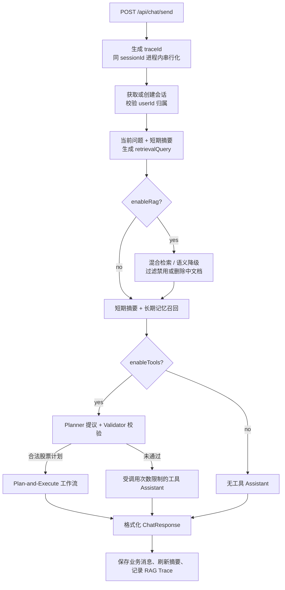
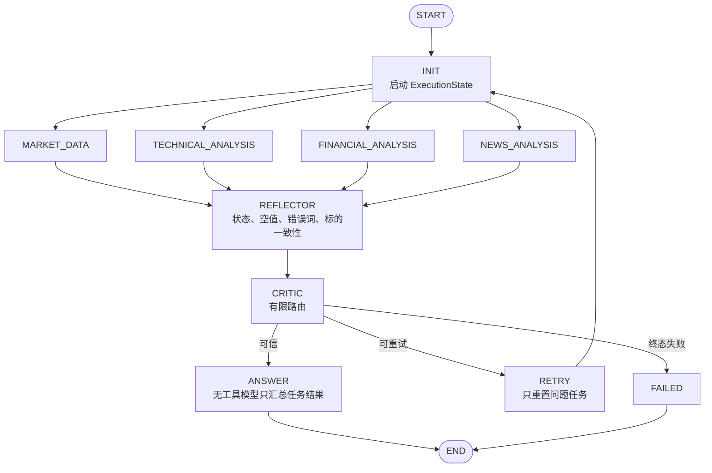

# Stock Insight Agent

[](https://github.com/LJLExplorer/ai-stock-agent-langchain4j/actions/workflows/ci.yml)


一个面向股票研究场景的 Java AI Agent：用 LangChain4j 组织模型与工具，用 LangGraph4j 编排可重试的 Plan-and-Execute 状态图，用 Milvus Dense + BM25 + RRF 完成混合检索，并用 Redis、MongoDB 构建分层记忆和执行状态持久化。

> 项目只提供研究辅助能力，不执行证券交易，不构成投资建议，也不承诺收益或预测准确率。

## 为什么不是普通的 ChatGPT Wrapper

项目重点不在“接一个模型接口”，而在模型输出如何进入受约束、可测试的后端系统：

| 工程问题 | 项目中的处理方式 | 可核验代码 |
| --- | --- | --- |
| LLM 生成的计划不可信 | Planner 只提出候选计划；Java 规则完成意图、标的和任务白名单校验 | `AgentPlannerAssistant`、`PlanValidator`、`PlannerTextParser` |
| 模型可能绕过流程乱调工具 | 图内任务由 `StockAnalysisTaskExecutor` 确定性映射；ANSWER 阶段使用无工具 Assistant | `StockAnalysisWorkflow`、`WorkflowAnswerGenerator` |
| 工具失败后容易生成“看似完整”的答案 | Reflector 用确定性规则校验结果，Critic 只允许有限路由，失败任务受次数上限约束 | `WorkflowReflector`、`WorkflowCritic`、`WorkflowRetryPolicy` |
| 单路向量检索对精确关键词不稳定 | 同一 Collection 执行 Dense ANN 与 BM25，再用 RRF 融合；融合结果还需通过稠密相似度阈值校验 | `MilvusHybridSearchClient`、`RetrievalService` |
| 长对话无限增长 | Redis 保留近轮原文，较早消息递归压缩为独立摘要；摘要失败时回滚原始窗口 | `RedisChatMemoryStore`、`ShortTermSummaryService` |
| 多用户长期记忆可能串数据 | 向量召回扩大候选池后按 `userId` 二次过滤，并校验 MongoDB 中的启用状态 | `LongTermMemoryService` |
| 状态并发更新可能互相覆盖 | MongoDB 按 `executionId + version` 条件替换；冲突直接失败，不用旧状态覆盖新状态 | `MongoExecutionStateStore`、`WorkflowRunner` |
| 公共仓库难以复现 | 脱敏配置模板、固定版本 Compose、测试分层、后端/前端 CI | `application.example.yml`、`compose.yaml`、`ci.yml` |

## 核心能力

- 股票实时行情、技术指标、财务数据、新闻检索、多股比较、组合分析和可选趋势预测工具。
- Planner → Validator → StateGraph → Reflector → Critic → Answer 的受限 Plan-and-Execute 链路。
- Milvus 2.5 Dense Vector + BM25 Sparse Vector + RRF 混合检索，并支持失败时降级为稠密语义检索。
- Redis 近轮消息窗口与递归摘要；MongoDB/Milvus 用户长期记忆；基于摘要的查询重写。
- MongoDB 执行快照、状态机、任务级重试历史与乐观锁冲突保护。
- `traceId`、`sessionId`、`executionId` 关联的模型、工作流和工具诊断日志；模型正文默认脱敏。
- React + Vite 前端，展示会话、知识来源、工具执行结果和长期记忆。

## 技术栈

| 层次 | 技术 |
| --- | --- |
| 后端 | Java 21、Spring Boot 3.3、Maven |
| Agent | LangChain4j 1.0.0-beta3、LangGraph4j 1.6.1 |
| 模型 | OpenAI-compatible Chat API、DashScope Embedding |
| 数据 | MongoDB、Redis、Milvus Java SDK 2.5.7 |
| 检索 | Dense COSINE、BM25、RRF、语义阈值复核 |
| 前端 | React 19、Vite 8、React Router |
| 工程化 | Docker Compose、JUnit 5、Mockito、GitHub Actions |

## 系统架构



### 一次请求的真实链路



Planner 只使用用户原始问题提出计划，不把 RAG 上下文当成执行指令。RAG 与长期记忆用于检索和普通回答；合法股票计划进入确定性工作流。这个边界降低了知识库文本或历史上下文改变工具权限的风险。

## Plan-and-Execute 工作流



这里有三个刻意的约束：

1. `AgentPlannerAssistant` 不注册任何 Tool，只能返回候选 JSON；`PlanValidator` 才决定计划是否能执行。
2. 图节点按任务类型直接调用 Java Tool，不让模型在执行阶段重新选择工具。
3. `WorkflowAnswerGenerator` 使用无工具 Assistant，只能总结经过 Reflector 校验的任务结果。

图中四类任务是从 `INIT` 分支并在 `REFLECTOR` 汇合的独立节点。当前实现没有提供并发性能基准，因此不宣称并行加速。代码中保留了 `ADD_NEWS` 扩展路由，但当前 Reflector 明确要求新闻任务必须由 Planner 提出，所以该路由目前不可达，不作为已交付能力宣传。

### 执行状态与 Checkpoint 边界

`ExecutionState` 保存计划、任务状态、尝试次数、结果历史、当前节点、最终答案和版本号。新执行会先写入 MongoDB，工作流结束后再按旧版本条件原子替换；`resume(executionId)` 从最近一次已持久化快照重新执行，已经完成的任务会跳过。

这不是“每个节点完成后立即落库”的细粒度 Checkpoint。若进程在一次图执行中途退出，恢复点是上一次成功保存的边界，可能需要重新执行尚未持久化的任务。乐观锁用于拒绝陈旧写入，不代表已经实现分布式调度、Exactly-once 或节点级事务。

## 混合 RAG

知识文档写入时同时保存 MongoDB 元数据与 Milvus 向量：

1. 文本分块并生成 Dense Embedding。
2. Milvus Function 从 `content` 生成 BM25 Sparse Vector。
3. 查询时构造 COSINE Dense ANN 与 BM25 两路请求。
4. `RRFRanker` 融合两路排名。
5. 使用带 `minScore` 的 Dense 检索再次校验融合候选，过滤“只有排名、语义不相关”的结果。
6. 根据 MongoDB 状态过滤已禁用和删除中的文档。
7. Hybrid 客户端失败且允许降级时，回退到单路 Dense 检索；关闭降级开关则直接暴露故障。

`KnowledgeService` 对跨 MongoDB/Milvus 写入采用补偿思路：写元数据失败时清理已写向量；删除时先标记状态，再重试删除向量，最后移除元数据。它降低了双写不一致概率，但不是跨数据库 ACID 事务。

## 分层记忆

### 短期记忆

- `RedisChatMemoryStore` 保存 LangChain4j 近轮原始消息，默认窗口上限 20 条。
- 消息数达到触发阈值且总字符数超过预算时，`ShortTermSummaryService` 将较早一半消息与旧摘要递归合并。
- 摘要为空、超长或 Redis 更新失败时不静默丢弃历史；服务尝试恢复原始窗口，并让主对话以 best-effort 方式继续。
- `userId:sessionId` 组成 memoryId，避免相同 sessionId 在不同用户间共用窗口。

### 长期记忆

- 只有用户通过 `/api/memories` 主动写入的内容才进入长期记忆。
- 原文、标签、归属和启用状态保存在 MongoDB，Embedding 与 `userId/memoryId` 元数据写入向量库。
- 召回时扩大共享向量库候选池，再按 `userId` 和 MongoDB 启用状态过滤，最多返回配置的 Top-K。
- 删除接口同时校验 `userId`，再删除向量和 MongoDB 记录。

当前长期记忆的用户隔离属于应用层过滤，不是 Milvus Partition 或数据库级租户隔离；生产多租户系统应进一步引入认证主体、服务端鉴权和向量库原生过滤。

## 工具与失败语义

系统注册七个业务工具：

| Tool | 作用 |
| --- | --- |
| `MarketDataTool` | 实时行情 |
| `TechnicalAnalysisTool` | MA、MACD、RSI、KDJ、布林带等技术指标 |
| `FinancialAnalysisTool` | 财务报告与估值指标 |
| `NewsRagTool` | 新闻、公告和研究资料 |
| `TimeSeriesPredictionTool` | 调用可选外部预测服务 |
| `StockComparisonTool` | 多股票统一口径比较 |
| `PortfolioAnalysisTool` | 组合收益、分布和集中度分析 |

工具统一返回 `ToolResult<T>`，区分 `success/data/errorCode/errorMessage/costTime`。普通 Assistant 的连续工具调用上限默认为 10；图工作流则由任务类型确定性调用工具。外部预测服务不可用不会被包装成“成功预测”，而是返回结构化失败。

## 可观测性与隐私

- 每次对话生成 `traceId`；工作流继续关联 `executionId`，会话使用 `sessionId`。
- `TracingChatLanguageModel` 统一记录模型调用开始、结束、耗时与异常。
- 模型请求和响应正文默认输出 `<redacted>`；只有显式设置 `TRACE_LOGGING_INCLUDE_CONTENT=true` 才记录，并受 `TRACE_LOGGING_MAX_CONTENT_LENGTH` 限制。
- 核心对话、RAG、知识库和工具日志默认只记录标识、长度、数量、状态与错误类型，不直接输出问题、上下文、文档标题或工具结果。
- 异常栈、第三方 SDK 日志和显式开启的模型正文仍需要部署侧的访问控制、保留周期与集中式脱敏策略。

不要在共享环境开启完整模型正文日志。它可能包含用户问题、检索上下文和模型输出。

## 快速开始

### 1. 环境要求

- JDK 21
- Maven 3.9+
- Node.js 20.19+（推荐 24）
- Docker Compose V2
- 至少一个兼容 OpenAI Chat API 的模型凭据
- 完整 RAG 需要 DashScope Embedding 与 Milvus

### 2. 配置

首次克隆时复制脱敏模板；如果本地文件已经存在，不要执行复制命令覆盖：

```bash
cp src/main/resources/application.example.yml src/main/resources/application.yml
cp .env.example .env
```

在本地 `.env` 中填写密钥，再导入环境变量。真实 `application.yml`、`application-test.yml` 和 `.env` 已被 Git 忽略。

```bash
set -a
source .env
set +a
```

完整字段、最小/完整能力矩阵及隐私开关见 [配置说明](docs/configuration.md)。

### 3. 启动基础设施

```bash
docker compose up -d
docker compose ps
```

Compose 固定 MongoDB、Redis、Milvus、etcd 与 MinIO 镜像版本，并为有状态服务配置命名卷和健康检查。

### 4. 启动后端与前端

```bash
mvn spring-boot:run
```

```bash
cd frontend
npm ci
npm run dev
```

默认地址：

- 后端：`http://localhost:8080`
- 健康检查：`http://localhost:8080/api/health`
- 前端：`http://localhost:5173`
- Milvus WebUI：`http://localhost:9091/webui/`

### 5. 请求示例

```bash
curl -X POST http://localhost:8080/api/chat/send \
  -H "Content-Type: application/json" \
  -d '{
    "userId": "demo-user",
    "message": "分析贵州茅台最近的走势，并说明主要风险",
    "orderId": "600519.SH",
    "enableRag": true,
    "enableTools": true
  }'
```

`enableTools=true` 时会先生成并校验计划；合法股票计划进入状态图，未通过则使用受工具调用上限约束的通用 Assistant。`enableRag=true` 时检索知识库并返回可展示的来源列表。

## 测试分层与 CI

```bash
# 默认离线测试：不连接 MongoDB、Redis、Milvus 或外部模型
mvn test

# 验证 integration-test Profile 配置，但跳过真实连接测试
mvn -Pintegration-test -DskipITs=true verify

# 基础设施与配置就绪后显式运行 *IT
mvn -Pintegration-test verify

# 前端锁文件安装与生产构建
npm --prefix frontend ci
npm --prefix frontend run build

# Compose 静态解析
docker compose config --quiet
```

GitHub Actions 将后端测试和前端生产构建拆成独立 Job。公共 CI 不注入个人密钥，也不伪装执行外部集成测试。

当前仓库包含 46 个 `*Test.java` 单元/组件测试类与 2 个 `*IT.java` 外部基础设施测试类。这个数字用于描述测试分层，不代表覆盖率；项目尚未发布覆盖率百分比。

## REST API

| 方法 | 路径 | 说明 |
| --- | --- | --- |
| POST | `/api/chat/send` | 发送消息，可控制 RAG 与 Tool |
| POST | `/api/chat/sessions` | 创建空会话 |
| GET | `/api/chat/sessions/{sessionId}/messages` | 查询会话消息 |
| GET | `/api/chat/users/{userId}/sessions` | 查询用户会话 |
| PATCH | `/api/chat/sessions/{sessionId}/title` | 修改会话标题 |
| POST | `/api/chat/sessions/{sessionId}/close` | 关闭会话 |
| DELETE | `/api/chat/sessions/{sessionId}` | 删除会话 |
| POST | `/api/chat/messages/{messageId}/feedback` | 提交反馈 |
| POST / GET | `/api/memories` | 新增/查询用户长期记忆 |
| GET | `/api/memories/recall` | 语义召回用户长期记忆 |
| DELETE | `/api/memories/{memoryId}` | 按请求中的 `userId` 校验后删除长期记忆 |
| POST | `/api/rag/search` | 指定 Top-K 检索 |
| POST | `/api/rag/query` | RAG 增强查询 |
| POST / GET | `/api/knowledge/documents` | 新增/查询知识文档 |
| POST | `/api/knowledge/feishu/sync` | 同步飞书文档 |
| POST | `/api/knowledge/documents/{id}/enable` | 启用文档 |
| POST | `/api/knowledge/documents/{id}/disable` | 禁用文档 |
| DELETE | `/api/knowledge/documents/{id}` | 删除文档 |
| GET | `/api/health`、`/api/info` | 健康与服务信息 |

会话历史、长期记忆等接口还需要相应的 `userId` 参数。当前 `userId` 由客户端提供，属于业务逻辑分区字段，不是经过认证的安全主体。

## 项目结构

```text
src/main/java/com/ljl/ai/
├── agent/          # AiServices、Prompt 与工具权限装配
├── client/         # 新闻、外部服务客户端
├── config/         # 模型、Redis、Milvus、记忆与工具配置
├── controller/     # REST API 与异常映射
├── knowledge/      # 文档分块、双写、状态与补偿
├── memory/         # Redis 消息窗口与递归摘要
├── observability/  # 模型调用 Trace 与隐私开关
├── planner/        # 候选计划解析、校验与任务枚举
├── rag/            # Hybrid Search、语义复核与 RAG Pipeline
├── service/        # 对话编排、长期记忆、业务消息
├── tools/          # 七个业务 Tool
└── workflow/       # StateGraph、执行状态、Reflector/Critic

frontend/           # React + Vite
docs/               # 配置、简历与面试材料
compose.yaml        # 本地基础设施
.github/workflows/  # 后端/前端 CI
```

## 关键设计取舍

| 取舍 | 当前选择 | 原因与代价 |
| --- | --- | --- |
| LLM 决策 vs Java 规则 | LLM 提议，Java 校验与路由 | 可测试、权限边界清楚；新增意图要同步规则 |
| 自主 Tool Calling vs 确定性执行 | 通用路径自主调用，股票计划路径确定性映射 | 兼顾开放问题与关键链路可控性 |
| Hybrid 失败处理 | 默认降级 Dense，可配置 fail-fast | 本地体验更稳；生产排障可能更偏好直接失败 |
| 短期上下文增长 | 原文窗口 + 递归摘要 | 控制上下文成本；摘要会有信息压缩损失 |
| 多存储一致性 | 状态标记、重试与补偿 | 实现成本低于分布式事务，但仍需对账机制 |
| 执行持久化粒度 | 工作流边界快照 | 当前实现简单；进程中断时可能重做未持久化任务 |

## 已知边界

- 没有真实交易、下单、券商账户接入或个性化投资顾问能力。
- 没有公开可复现的收益率、预测准确率、QPS、P95 延迟或成本基准，因此不展示这些数字。
- `/api` 当前没有完整的登录认证、RBAC、限流和审计体系；`userId` 是业务参数，不应当作可信身份。
- 会话锁是单 JVM 内锁，多实例部署需要分布式并发控制。
- 执行状态不是节点级 Checkpoint，不保证 Exactly-once。
- MongoDB 与 Milvus 间使用补偿而非 ACID 事务，极端失败仍需要后台对账/修复任务。
- 长期记忆在应用层按用户过滤；严格多租户应增加认证主体与存储层过滤。
- 外部模型、新闻、飞书和预测服务的可用性与配额不由本仓库保证。
- Compose 面向本地开发，不是生产高可用部署方案。

## 简历与面试

[简历与面试材料](docs/resume-and-interview.md) 提供 Java 后端、AI Agent、校招通用三版描述，以及源码能够支撑的追问要点。建议根据目标岗位选择一版，不要把三版内容全部堆进一份简历。

## License

[MIT](LICENSE)
