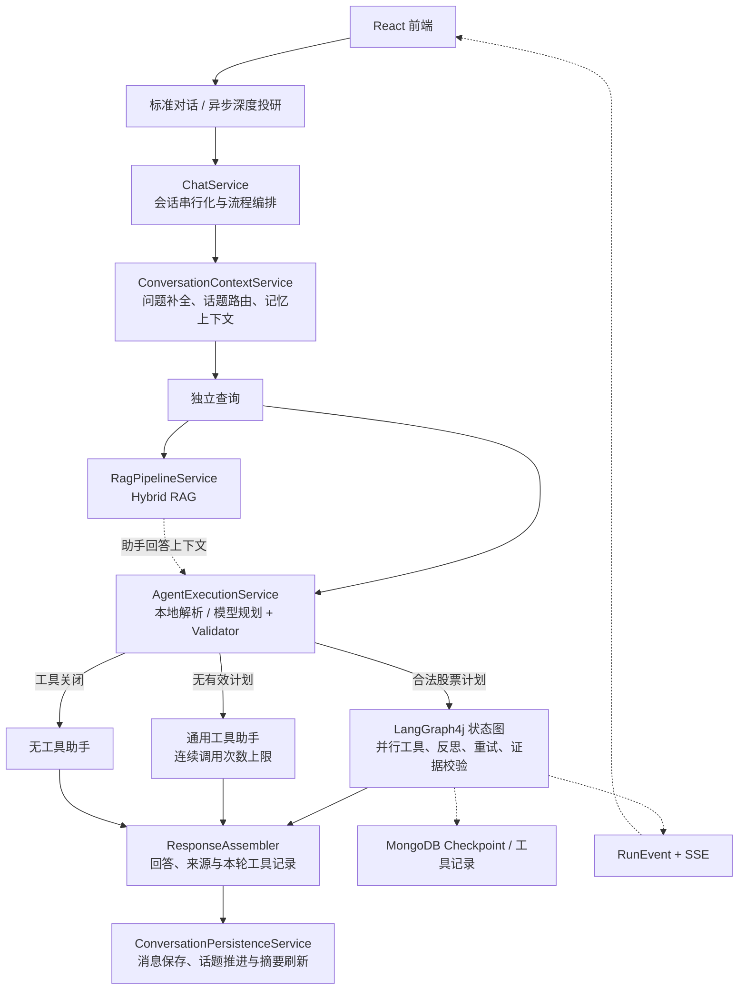
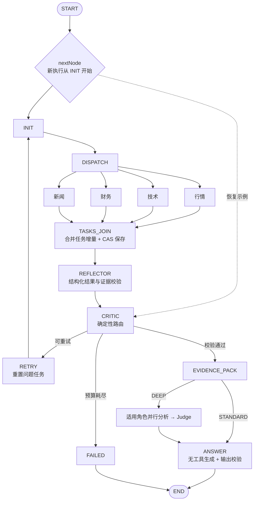

# Stock Insight Agent

[](https://github.com/LJLExplorer/ai-stock-agent-langchain4j/actions/workflows/ci.yml)


面向股票研究的 Java AI Agent，支持行情、技术、财务、新闻分析，以及知识库问答和多轮对话。项目使用 LangChain4j 接入模型与工具，使用 LangGraph4j 编排任务，将计划校验、并行执行、失败重试、检查点恢复和证据引用落实为可测试的后端逻辑。

用户可以指定股票和分析日期，查看当时可见的数据与来源；也可以切换到深度投研，让多个角色基于同一份证据给出观点，再由 Judge 汇总。数据不足或校验失败时，系统返回明确的失败或降级说明。

> 本项目用于研究辅助，不执行证券交易，不构成投资建议。

[快速开始](#快速开始) · [执行架构](#执行架构) · [关键实现](#关键实现) · [测试与验证](#测试与验证) · [简历与面试](docs/resume-and-interview.md)

## 功能概览

| 能力 | 当前实现 |
| --- | --- |
| 标准分析 | 同步股票问答；合法计划进入确定性工作流，支持行情、技术、财务和新闻任务 |
| 深度投研 | 异步接单，按证据范围并行运行适用角色，再由 Judge 输出结构化结论；前端展示 SSE 进度 |
| 知识库问答 | 文档与飞书资料入库，Milvus Dense + BM25 + RRF 混合检索，Parent/Child 分层上下文 |
| 多轮对话 | 查询改写、股票话题切换与返回、Redis 原文窗口和递归摘要、用户主动录入的长期记忆 |
| 执行与来源追踪 | MongoDB 检查点、工具执行记录、金融证据 ID、数据截止日与受控运行事件 |
| 决策复盘 | 保存成功的深度结论，计算后续交易日收益，作为之后研究的校准参考 |

技术栈：Java 21、Spring Boot 3.3.0、LangChain4j 1.0.0-beta3、LangGraph4j 1.6.1、MongoDB、Redis、Milvus 2.5、React、Vite。版本以 [pom.xml](pom.xml)、[前端依赖](frontend/package.json) 和 [Compose](compose.yaml) 为准。

## 快速开始

### 1. 准备环境与配置

需要 JDK 21、Maven 3.9+、Node.js 20.19+、npm 10+ 和 Docker Compose V2；前端 CI 使用 Node.js 24。

首次运行时复制配置模板，`-n` 用于保留已有本地配置：

```bash
cp -n src/main/resources/application.example.yml src/main/resources/application.yml
cp -n .env.example .env
```

在 `.env` 中填写模型凭据。按示例配置运行完整功能，需要 `OPENAI_API_KEY` 和 `DASHSCOPE_API_KEY`；新闻搜索至少配置 `TAVILY_API_KEY` 或 `SERPAPI_API_KEY`。飞书同步和外部预测服务按需配置。

```bash
set -a
source .env
set +a
```

环境变量需导入启动后端的终端；使用 IDE 时配置对应的运行环境变量。配置字段和服务说明见 [配置文档](docs/configuration.md)。本地 `.env`、`application.yml` 和 `application-test.yml` 已被 Git 忽略。

### 2. 启动基础设施与应用

```bash
docker compose up -d
docker compose ps
mvn spring-boot:run
```

另开终端启动前端：

```bash
cd frontend
npm ci
npm run dev
```

| 入口 | 默认地址 |
| --- | --- |
| 前端 | `http://localhost:5173` |
| 后端健康检查 | `http://localhost:8080/api/health` |
| Milvus WebUI | `http://localhost:9091/webui/` |

Compose 提供 MongoDB、Redis、Milvus 及其 etcd、MinIO 依赖，配置了固定镜像版本、命名卷和健康检查。知识库检索需要先录入文档；外部预测工具还需要独立预测服务。

### 3. 发起标准分析

```bash
curl -X POST http://localhost:8080/api/chat/send \
  -H "Content-Type: application/json" \
  -d '{
    "userId": "demo-user",
    "message": "分析贵州茅台最近的走势，并说明主要风险",
    "orderId": "600519.SH",
    "enableRag": true,
    "enableTools": true
  }'
```

`orderId` 在当前接口中用于传入股票标识。继续对话时携带返回的 `sessionId`。`enableRag` 控制知识检索，`enableTools` 控制工具能力；二者分别生效。

### 4. 发起深度投研

```bash
curl -X POST http://localhost:8080/api/research/executions \
  -H "Content-Type: application/json" \
  -d '{
    "userId": "demo-user",
    "message": "基于指定分析日可见的信息，分析贵州茅台的基本面、技术面和新闻风险",
    "orderId": "600519.SH",
    "analysisDate": "2025-06-30",
    "researchMode": "DEEP",
    "enableRag": true,
    "enableTools": true
  }'
```

接口返回 HTTP 202，以及 `executionId`、`sessionId` 和 `submittedAt`。用返回的执行 ID 查询状态或订阅事件：

```text
GET /api/research/executions/{executionId}?userId=demo-user
GET /api/research/executions/{executionId}/events?userId=demo-user
```

事件接口使用 `text/event-stream`。前端提供模式切换、阶段时间线、来源查看和断线后的手动重连。历史日期示例用于展示时点约束，能否完成分析取决于外部来源是否提供足够的历史数据。

## 执行架构



`ChatService` 保留入口协调、同会话串行化和 MDC 追踪；上下文准备、Agent 执行、响应组装、持久化与失败处理分别交给职责服务。详细调用关系和行为约定见 [对话服务职责拆分](docs/chat-service-refactoring.md)。

同一份独立查询用于 RAG、长期记忆召回和 Planner。RAG 文本不作为计划指令；工作流有最终答案时直接使用，工作流回答的事实边界是经过校验的工具证据。通用助手保留自主 Tool Calling，其约束范围与确定性股票工作流不同。

## 关键实现

### 1. 计划校验与并行状态图

明确请求先尝试本地规则解析，不能得到有效计划时再调用无工具的 Planner。所有候选都经过 `PlanValidator`，检查意图、股票代码与任务白名单，再按任务类型映射到 Java 工具。



四类分支通过四线程执行器并行调度，只执行计划包含的任务。`WorkflowAgentState` 使用深度只读数据，节点遵循 `State → Node → Delta`：工具分支只能更新自身任务，`tasks` 按 `taskId` 合并，证据在汇合后统一重建。分支不分别覆盖整份快照，避免兄弟结果丢失和同版本 CAS 冲突。

Reflector 与 Critic 都是 Java 规则。前者校验结果，后者决定重试、回答或失败；代码保留 `ADD_NEWS` 扩展路由，当前不会自动追加 Planner 未提出的新闻任务。

### 2. 检查点与工具幂等恢复

`ExecutionState` 是持久化快照，记录计划、任务结果、反思与裁决、重试次数、`nextNode`、图版本和计划哈希。

- 串行节点和 `TASKS_JOIN` 用 `executionId + version` 做 MongoDB CAS，保存成功后发布完成事件。版本冲突拒绝旧状态写入。
- `WorkflowRunner.resume(executionId)` 校验 `graphVersion + planHash`，从快照的下一节点恢复。当前图协议为 `stock-analysis-v3`，未完成的 v1/v2 快照不自动迁移。
- 工具记录以 `executionId:taskId:attempt` 唯一标识一次尝试，原子保存成功结果与证据快照。汇合前中断时，已成功工具可复用记录；遗留 `STARTED` 仅对当前四类只读工具允许新 attempt 重试。
- 恢复到证据或模型节点时重新校验任务、重建证据包，不能仅凭快照中的 `trusted`、`modelView` 或哈希放行。

这是应用层 MongoDB 快照和显式恢复游标，尚未接入 LangGraph4j 原生 CheckpointSaver；恢复语义为 at-least-once，不保证任意外部副作用 Exactly-once。

### 3. 从工具成功到证据可用

`ToolResult.success` 只表示调用成功。行情返回 `StockQuote`，技术和财务工作流入口返回带 `BigDecimal` 指标的 `AnalysisToolPayload`，新闻返回 `List<NewsItem>`。展示文案不作为结构化数值来源。

```text
AnalysisContext → 工具成功快照 → Schema / 时点 / 来源 / 数值校验
                → FinancialFact → EvidencePack → 回答 → ClaimEvidenceGuard
```

`AnalysisContext` 统一标的与 `analysisDate`。K 线按截止日截断，财务按披露时间约束，新闻校验发布时间；历史数据缺失时不拿当前值回填。校验同时检查必需指标、数值类型与范围、来源链接、时效和本次证据覆盖，重试历史不能补足本次缺失。

`FinancialFact` 保留指标、值、单位、来源和时间，并生成稳定 `evidenceId`；`EvidencePack` 汇总本次证据、缺失项、工具失败、数据截止日和内容哈希。回答使用 `[evidence:ev-...]` 关联本轮有效证据；Guard 拒绝未知/跨包 ID、缺少引用的数值表达和超出截止日的日期，质量门禁检查重复及异常正文。标准工作流回答最多纠正一次，再失败则确定性降级。

这些检查保证协议与证据关联满足规则，不证明外部数据绝对真实，也不等于逐句完成语义事实核验。具体门槛、错误码与测试见 [工作流校验说明](docs/workflow-validation.md)。

### 4. Hybrid RAG 与 Parent/Child 上下文

```text
文档 → Parent 章节 → Child 分块 → Dense + BM25 → RRF
     → 文档状态 / 活动版本过滤 → Parent 全文或命中窗口 → TopK
```

Dense 处理语义近似，BM25 补充股票代码、公司名、指标名等精确词召回，RRF 按名次融合。融合候选保留 BM25 独有命中，不再与额外的 Dense 结果取交集；`minScore` 仅用于单路 Dense 路径。Hybrid 失败可按配置降级 Dense，当前没有接入 Cross Encoder 或 LLM Reranker。

长文先按标题层级划分 Parent，再按段落、句子和字符边界生成 Child。默认目标为 700 字符，常规范围 600～800，重叠 80～120；短章节和尾块按实际长度处理。索引文本包含标题路径，Parent 正文、摘要和 Child offset 保存在 MongoDB。

召回后，短 Parent 返回全文，长 Parent 返回抽取式摘要与命中块前后窗口；按原文 offset 合并重叠区间。文档状态与 `activeIngestionVersion` 决定可见性，防止禁用文档和旧版本进入上下文。双存储写入、删除采用状态标记与失败补偿，仍需考虑极端故障下的对账修复。

### 5. 话题路由与递归记忆

| 数据 | 存储与作用 |
| --- | --- |
| 完整业务消息 | MongoDB；用于历史展示和近期对话查询 |
| 当前/最近话题 | Redis；识别 `NEW / CONTINUE / SWITCH / RETURN` |
| 话题原文窗口 | Redis；按用户、会话、话题隔离模型上下文 |
| 话题摘要 | Redis；旧摘要与较早消息递归合并，保留最近原文 |
| 用户长期记忆 | MongoDB + Milvus；主动录入偏好或事实，跨会话召回 |

`QueryRewriteAssistant` 结合近期业务消息、当前摘要和最近话题生成独立查询。Java 处理空输出与非 JSON 降级，并对显式六位股票代码做确定性保护；同一话题使用稳定记忆 ID，支持切换股票后再返回旧话题。

消息数或字符预算触发压缩时，先生成并校验新摘要，再通过 Redis Lua 比对旧消息和旧摘要，原子裁剪窗口、写入摘要并刷新 TTL。生成失败不提交压缩，生成期间窗口变化则放弃本次提交；切分点保留完整工具调用与结果组。摘要仍是有损压缩，话题识别也仍部分依赖模型。

### 6. 深度投研、运行事件与复盘

深度模式按证据范围选择基本面、技术面和新闻角色，结合看多、看空、风险视角并行生成独立意见，按预定顺序汇总后调用一次 Judge。每个角色最多调用一次，不挂载业务工具或会话记忆；Judge 输出经过评级、置信度、日期、正文和证据 ID 校验。部分角色失败会记录限制，Judge 失效则返回 `INSUFFICIENT_DATA`。

异步研究默认使用 2 个工作线程和 32 个排队位。RunEvent 使用固定事件枚举、递增 sequence 与有界摘要，每次执行保留最近 200 条事件；SSE 回放后补发订阅间隙事件。事件不包含 Prompt、模型思考正文或工具正文。前端断线后查询执行状态补偿，并提供手动重连。

**当前只支持单实例部署。** 队列与事件缓冲在进程内；进程重启时，`StartupRecoveryRunner` 将遗留非终态执行标记为失败并提示重新发起，不自动调用 `resume()`。启动补偿还会将遗留文档清理状态转为可重试失败状态；补偿失败会阻止应用就绪。

成功的深度结论可幂等保存为 `ResearchDecision`。复盘服务不调用 LLM，而是计算后续 1/5/20 个交易日的标的收益和相对基准收益；只有在本次分析日已可见、且用户与标的一致的复盘才作为校准参考，不能冒充本轮证据。

## 工具与 API

系统注册 7 个业务工具；确定性股票工作流覆盖其中的行情、技术、财务和新闻四类。

| 工具 | 用途 |
| --- | --- |
| `MarketDataTool` | 行情及按分析日读取数据 |
| `TechnicalAnalysisTool` | 日 K、收盘价、涨跌幅、MA5、MA20 与均线趋势 |
| `FinancialAnalysisTool` | 财务报告与估值指标 |
| `NewsRagTool` | 公司新闻和官方披露检索 |
| `TimeSeriesPredictionTool` | 调用可选外部预测服务 |
| `StockComparisonTool` | 多股票比较 |
| `PortfolioAnalysisTool` | 组合收益、分布与集中度分析 |

新闻搜索同时尝试媒体和官方披露，校验主体、类型、来源域名和发布时间。配置发行人目录时可提取报告入口与披露日期；发现 PDF 链接不代表已读取全文或核对财务指标。来源配置与搜索流程见 [工具与证据质量说明](docs/tool-execution-and-evidence-quality.md)。

| 方法 | 路径 | 用途 |
| --- | --- | --- |
| POST | `/api/chat/send` | 同步对话 |
| POST | `/api/research/executions` | 创建异步深度投研 |
| GET | `/api/research/executions/{executionId}` | 查询状态与结果 |
| GET | `/api/research/executions/{executionId}/events` | SSE 事件回放与订阅 |
| POST | `/api/chat/sessions` | 创建会话 |
| GET | `/api/chat/users/{userId}/sessions` | 用户会话列表 |
| GET | `/api/chat/sessions/{sessionId}/messages` | 会话消息 |
| PATCH | `/api/chat/sessions/{sessionId}/title` | 修改标题 |
| POST | `/api/chat/sessions/{sessionId}/close` | 关闭会话 |
| DELETE | `/api/chat/sessions/{sessionId}` | 删除会话 |
| POST | `/api/chat/messages/{messageId}/feedback` | 消息反馈 |
| POST / GET | `/api/memories` | 新增/查询长期记忆 |
| GET | `/api/memories/recall` | 语义召回长期记忆 |
| DELETE | `/api/memories/{memoryId}` | 删除长期记忆 |
| POST | `/api/rag/search`、`/api/rag/query` | 检索与 RAG 查询 |
| POST / GET | `/api/knowledge/documents` | 新增/查询文档 |
| POST | `/api/knowledge/feishu/sync` | 同步飞书文档 |
| POST | `/api/knowledge/documents/{id}/enable`、`/api/knowledge/documents/{id}/disable` | 启用或禁用文档 |
| DELETE | `/api/knowledge/documents/{id}` | 删除文档 |
| GET | `/api/health`、`/api/info` | 健康与服务信息 |

会话、记忆和研究查询需携带相应的 `userId`。具体请求字段见 [Controller](src/main/java/com/ljl/ai/controller)；当前 `userId` 是客户端提供的业务参数，不是经过认证的身份。

## 测试与验证

```bash
# 默认离线单元/组件测试
mvn test

# 固定样本 Agent Eval
mvn -Dtest=AgentEvalRunnerTest test

# 验证集成测试 Profile，跳过真实基础设施连接
mvn -Pintegration-test -DskipITs=true verify

# 基础设施与本地配置就绪后运行 *IT
mvn -Pintegration-test verify

# 前端测试与生产构建
npm --prefix frontend ci
npm --prefix frontend test
npm --prefix frontend run build

# Compose 配置检查
docker compose config --quiet
```

默认后端测试不依赖外部模型、网络或业务数据库。真实 MongoDB/Milvus 测试使用 `*IT` 和显式 Profile；新闻联网检查需单独启用 `mvn -Dtest=NewsSearchLiveTest -Dnews.live=true test`。GitHub Actions 分别运行后端默认测试与前端生产构建，前端测试可用上述命令单独执行。

| 验证主题 | 代表测试 |
| --- | --- |
| 计划和服务编排 | `AgentExecutionPlannerTest`、`ChatServiceOrchestrationTest`、`ChatServiceWiringTest` |
| 并行与状态增量 | `StockAnalysisWorkflowTest`、`WorkflowAgentStateTest`、`WorkflowNodeDeltaTest` |
| 恢复与幂等 | `WorkflowRunnerTest`、`MongoExecutionStateStoreTest`、`MongoToolExecutionStoreTest` |
| 结构化结果与恢复后的证据边界 | `WorkflowResultValidatorTest`、`StructuredToolWorkflowTest`、`WorkflowEvidenceBoundaryTest` |
| 检索与记忆 | `RetrievalServiceTest`、`ConversationQueryRewriteTest`、`ShortTermSummaryServiceTest` |
| 输出与深度投研 | `ClaimEvidenceGuardTest`、`WorkflowAnswerGeneratorTest`、`DeepResearchServiceTest` |

离线 Agent Eval 使用 5 个固定样本与确定性适配器，保护规划、话题、检索、证据和恢复契约。它是回归基线，不代表真实模型准确率或投资收益；并行测试验证任务重叠执行与结果完整性，也不能代替线上延迟基准。

## 项目结构与阅读入口

```text
src/main/java/com/ljl/ai/
├── agent/          # 模型接口、Prompt 与工具权限
├── client/         # 行情、新闻和外部服务
├── config/         # 模型、存储和业务配置
├── controller/     # REST API
├── knowledge/      # 分层切分、文档入库与补偿
├── memory/         # 查询改写、话题窗口与摘要
├── observability/  # 模型 Trace、RunEvent 与事件发布
├── planner/        # 计划解析、白名单与任务类型
├── rag/            # 混合检索、版本过滤与父块扩展
├── research/       # 分析时点、证据、角色分析与复盘
├── service/        # 对话协调、职责服务与异步执行
├── tools/          # 业务工具
└── workflow/       # 状态图、Checkpoint、幂等与结果校验
frontend/           # React 界面与 SSE 客户端
src/test/           # 单元/组件、集成测试与离线样本
docs/               # 配置、设计说明和面试材料
```

从 [ChatService](src/main/java/com/ljl/ai/service/ChatService.java) 阅读一轮对话，再进入 [AgentExecutionService](src/main/java/com/ljl/ai/service/AgentExecutionService.java) 和 [StockAnalysisWorkflow](src/main/java/com/ljl/ai/workflow/StockAnalysisWorkflow.java)。检索链路从 [RetrievalService](src/main/java/com/ljl/ai/rag/RetrievalService.java) 开始。

## 适用范围与后续方向

- 目前是可本地复现的单实例项目，尚未具备完整认证、RBAC、限流与分布式调度；会话锁和事件缓存均在单 JVM 内。
- MongoDB 与 Milvus 使用补偿而非跨存储 ACID 事务。长期记忆在共享候选池召回后按用户与启用状态过滤，严格多租户仍需认证主体与存储层隔离。
- 没有公开的真实市场收益率、模型准确率、QPS、P95 或成本基准。后续应以标注数据、真实依赖集成测试和压测验证效果。
- 模型请求/响应正文默认脱敏；`TRACE_LOGGING_INCLUDE_CONTENT` 仅用于受控排障，第三方日志与异常链仍需部署侧管理。
- 外部行情、搜索、模型、飞书和预测服务受各自可用性与配额约束；Compose 用于本地开发。

## 简历与面试

[简历与面试材料](docs/resume-and-interview.md) 包含 Java 后端、AI Agent、校招通用三版项目描述，一分钟介绍，以及围绕并行状态、恢复、证据、RAG 和记忆的追问。每个主题提供源码或测试入口，便于按实际负责范围准备。

## License

[MIT](LICENSE)
