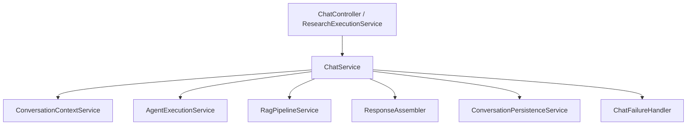

# 对话服务职责拆分

`ChatService` 从 1,058 行缩减到约 144 行，保留对话入口、会话串行化、MDC 追踪和流程编排。Controller 的接口、响应 DTO、异步研究句柄和消息存储结构保持兼容。

| 组件 | 职责 | 主要输出 |
| --- | --- | --- |
| `ConversationContextService` | 补全股票问题、话题路由、查询改写、近轮消息筛选、摘要与长期记忆召回 | `PreparedContext`、模型记忆上下文 |
| `AgentExecutionService` | 本地/模型计划解析与校验、研究上下文和历史复盘准备、Workflow/Agent 调用、答案格式化 | `AgentResult`，包含答案和执行状态 |
| `RagPipelineService` | 复用既有检索管线，处理对话 RAG 开关、空检索结果和追踪信息 | `ChatRetrieval` |
| `ResponseAssembler` | 收集本轮工具调用、转换网页与 Evidence 来源、来源去重、构造成功响应 | `ResponseContent`、`ChatResponse` |
| `ConversationPersistenceService` | 会话权限与生命周期、消息保存、研究决策保存、话题推进、摘要刷新、RAG 追踪落库 | 助手消息 ID |
| `ChatFailureHandler` | 错误分类、受控失败响应、异常模型记忆清理 | 失败 `ChatResponse` |

从 [ChatService.chatInternal](../src/main/java/com/ljl/ai/service/ChatService.java) 阅读主流程，再根据问题进入对应服务即可。各步骤通过具有明确字段的 record 传递中间结果；这些对象只在后端内部使用。

## 保留的行为约定

- 已有会话的请求在同一 JVM 内串行执行；不同会话可并行。锁仍覆盖上下文读取到消息保存的完整流程，不承担跨实例的分布式互斥。
- 用户原文用于业务消息和默认标题；补全后的问题用于模型执行，独立改写后的检索问题用于 RAG、Planner 和长期记忆召回。
- Topic 决定模型窗口和摘要的记忆 ID。执行前先记录旧工具调用 ID，返回时只收集本轮新增调用，再加入 Workflow 的任务记录。
- Workflow 已给出最终答案时直接使用该答案；Planner 失败时保留完整工具助手降级路径。
- 异步研究使用预分配的 executionId；已接单的会话被删除、关闭或不属于用户时，不能静默新建替代会话。
- 消息保存调用返回后再推进话题、刷新摘要并保存 RAG 追踪。摘要和研究决策保存保留 best effort 行为；业务消息保存抛出异常时不继续这些步骤。沿用原有助手消息返回 null 时生成备用消息 ID 的兼容行为。
- 工具循环超限或连接中断时清理当前 Topic 的模型记忆；清理失败也返回受控提示，且不向用户透传内部异常。

本次拆分没有引入 MongoDB 与 Redis 的跨存储事务，消息、话题和摘要的失败语义沿用原实现。

## 验证入口

- `ChatServiceOrchestrationTest`：真实职责服务之间的数据传递、RAG 分支、异步句柄、持久化顺序、异常清理与并发边界。
- `ChatServiceWiringTest`：Spring 装配及两个助手 Bean 的选择。
- `AgentExecutionPlannerTest` / `AgentExecutionWorkflowTest`：计划降级、执行状态和研究上下文。
- `ConversationQueryRewriteTest` / `ConversationMemoryContextTest`：话题、查询改写与记忆上下文。
- `ConversationPersistenceMemoryTest` / `ConversationDecisionPersistenceTest`：删除会话时清理全部话题记忆、研究决策保存条件。
- `ResponseAssemblerTest`：网页/Evidence 来源、去重、本轮工具记录和结构化失败结果。

在 JDK 21 环境下执行 `mvn test`。真实 MongoDB/Milvus 的 `*IT` 与显式启用的在线测试使用原有测试配置。
