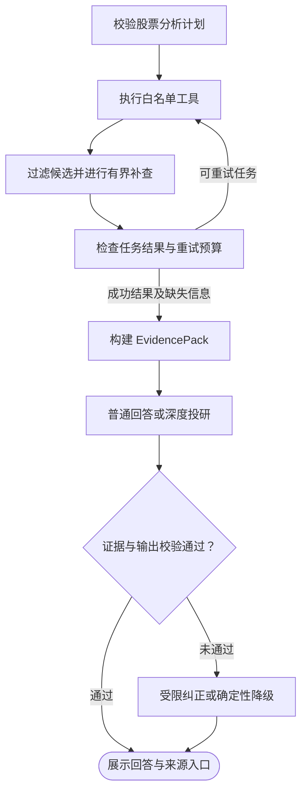

# 工具调用与证据质量控制流程

*用途：解释股票分析工作流如何调用工具、过滤无效搜索结果并校验回答，供开发排查与面试复述使用。对应代码状态：2026-09-07。*

---

## 🎯 核心原则与适用范围

模型负责提出分析计划，Java 代码负责校验计划、执行工具和控制重试；搜索结果先作为候选，经过过滤和证据整理后才进入结论生成。不能把“接口返回成功”“找到一个链接”和“足以支持结论”当成同一件事。

本文描述股票分析工作流，重点是 `NEWS_ANALYSIS` 的联网搜索，不代表普通知识库 RAG 的所有召回路径。这里过滤的 skill、README、安装教程等内容，是因为它们不能作为本次股票新闻或财务事实的依据；不是说教程在所有场景都没有价值。**利空、诉讼、监管处罚等负面新闻，只要相关且满足来源和时间要求，就应保留。**

## 🔄 整体流程



这是逻辑总览，不是精确的图节点拓扑。搜索补查发生在新闻客户端内部；任务重试由工作流控制；回答纠正只适用于普通回答路径。任务重试耗尽可进入失败路由，不能当作正常成功结果。降级输出应解释缺失或失败原因，不伪造评级、证据或原文链接。

## 🔧 第一步：怎样选择并调用工具

1. 进入股票工作流后，由本地规划解析或 `AgentPlannerAssistant` 产生候选计划。显式股票代码的请求可以走本地解析，不必每次调用模型规划。
2. `PlanValidator` 检查意图、股票代码格式、任务是否为空或非法，并规范化股票代码、去重任务。无效计划不能直接进入工具执行。
3. `StockAnalysisTaskExecutor` 按任务枚举进行 `switch` 分发。模型不能在这条路径中任意构造 Java 方法名或执行命令。
4. 工具共享 `AnalysisContext` 中的标的与分析截止日，返回 `ToolResult`。任务节点记录执行状态、结果、错误和实际耗时。

| 计划任务 | 受控工具入口 | 主要数据 |
| --- | --- | --- |
| `MARKET_DATA` | `MarketDataTool.getQuote(symbol, context)`；无上下文入口为 `getRealtimeQuote` | 行情及其时点 |
| `TECHNICAL_ANALYSIS` | `TechnicalAnalysisTool` 的结构化工作流入口 | K 线及技术指标，返回 `AnalysisToolPayload` |
| `FINANCIAL_ANALYSIS` | `FinancialAnalysisTool` 的结构化工作流入口 | 财务指标、报告期和披露信息，返回 `AnalysisToolPayload` |
| `NEWS_ANALYSIS` | `NewsRagTool.searchStockNewsAndAnnouncements` | 公司新闻与官方披露 |

当前四类工具分支从 `DISPATCH` 并行调度，只执行计划包含的任务，在 `TASKS_JOIN` 按 taskId 合并增量后统一保存检查点。分支读取只读状态，不能更新兄弟任务。深度投研中的适用专家角色也可以并行分析，但角色本身不挂载工具。`WorkflowReflector` 不会擅自追加新闻任务：如果计划只有技术分析，就不能宣称已经查过新闻和财报。

代码：[PlanValidator](../src/main/java/com/ljl/ai/planner/PlanValidator.java)、[StockAnalysisTaskExecutor](../src/main/java/com/ljl/ai/workflow/StockAnalysisTaskExecutor.java)、[StockAnalysisTaskNode](../src/main/java/com/ljl/ai/workflow/StockAnalysisTaskNode.java)。

## 🔍 第二步：检索真正相关的新闻与官方披露

### 构造查询，而不是照抄整个用户问题

`NewsSearchClient` 先提取股票代码，并尝试从行情接口取得公司名称。名称解析失败时保留代码检索，不凭模型猜测公司官网。

新闻查询使用“公司新闻、公告”等受控词，只从用户问题中提取业绩、财报、分红、回购、增减持、监管、诉讼、重组等限定关键词。不会把整段 skill 指令或 GMMA 教程原样拼进新闻查询，避免搜索方向被分析方法描述带偏。

### 媒体新闻与官方披露两条来源路径

- 媒体路径搜索近期公司新闻；有 Tavily 配置时使用其新闻搜索，否则使用已配置的 SerpAPI。
- 官方路径限定交易所、巨潮资讯及已配置的发行人域名，使用财务报告、投资者关系、公司公告等查询。即使媒体数量已经足够，也至少执行一轮官方路径。
- Tavily 路径支持先提取已配置的公司财报目录；提取失败或没有条目时再搜索官方站点。当前内置茅台官网域名和财报目录映射，其他发行人的官网映射需要维护，不能宣称全市场官网已经自动接入。
- 官方搜索返回后仍会在本地校验域名，不能只相信搜索服务的 `include_domains` 或 `site:` 参数。

官网目录解析把每条报告标题、该条披露日期和实际文件链接绑定起来，并解析相对链接。**目录中发现财报 PDF，只证明发现了报告入口和披露日期，不等于已读取 PDF 全文或核对其中全部财务指标。** 这类结果的摘要会明确说明尚未提取全文或指标。

## 🛡️ 第三步：候选结果逐层过滤

过滤发生在候选进入证据包之前，不是先把无效内容交给模型，再仅靠 Prompt 要求模型忽略。

| 检查层 | 当前规则 | 不通过时 |
| --- | --- | --- |
| 内容类型与链接 | 标题非空、HTTP(S) 地址；排除 skill、README、安装/开发教程、提示词模板等标记，以及 GitHub、GitLab、Gitee、skills.sh 等仓库或技能站点 | `NOT_NEWS_ARTICLE` |
| 标的相关性 | 标题或摘要包含股票代码，或已解析出的公司名称 | `STOCK_NOT_MATCHED` |
| 发布时间 | 必须能解析为真实的发布时间字段，不能拿抓取时间冒充发布时间 | `PUBLICATION_TIME_UNKNOWN`；未来日期也会被拒绝 |
| 时间窗口 | 媒体新闻通常取截止日内最近 30 天；官方披露单独使用 366 天窗口，避免年报被新闻窗口误杀 | `OUTSIDE_NEWS_WINDOW` |
| 官方域名 | 官方路径返回的链接必须属于允许的域名或其子域名 | 排除冒充官方的来源 |
| 媒体语义相关性 | 配置 Embedding 时，对已通过硬规则的媒体结果计算余弦相似度，默认阈值为 `0.45` | 去掉低相关结果 |
| 去重与来源配额 | 按 URL 去重，必要时以标题兜底；优先保留官方报告，再补媒体来源 | 不用重复链接凑数量 |

发布时间解析支持 ISO、英文 GMT/RFC 1123、常见中英文日期等格式，并统一为 ISO 时间，避免新闻层能读懂、证据层却再次解析失败。缺少结构化日期时，只提取正文中明确标注的“发布时间、发布日期、公告日期”；官网目录则绑定该行的披露日期。报告期、PDF 路径中的年月和抓取日期都不能随意代替披露日期。

官方候选通过域名、标的、类型和时间硬规则后，不再因 Embedding 分数低被删除，避免“公司年报”与“近期新闻”表达不同而漏掉重要披露。媒体 Embedding 未配置或异常时，会保留已经通过硬规则的候选并记录降级，不是所有过滤都失效，也不是语义过滤失败就全部拒绝。

通常请求最多 5 条结果；来源足够时优先安排最多 3 条官方结果，再由媒体补足，媒体不足时可由其他官方结果补位。找不到合格来源时允许少于目标数量，不拿教程或重复行情页补数。

实现入口：[NewsSearchClient](../src/main/java/com/ljl/ai/client/NewsSearchClient.java)。

## ⏰ 第四步：结果不好时怎样补查、重试和停止

### 新闻客户端内部：扩大覆盖，不放松质量门槛

默认 `maxRetries=3`，表示首轮加最多三轮补查，共最多四轮，按“媒体 → 官方 → 扩展媒体 → 扩展官方”交替执行。正常目标是至少 3 条合格结果且含官方来源；满足目标并完成媒体、官方两类尝试后可以提前停止。代码至少预留两轮，即使把该配置设为 0 也会尝试媒体和官方两条路径。

补查改变查询覆盖面，不取消来源、标的和日期校验。某轮异常可继续后续轮次；有此前合格结果时保留，最终没有结果且末轮异常时向上报告失败。当前没有实现 Tavily 请求失败后自动切换 SerpAPI；提供商选择与同一提供商内的补查不是一回事。

### 工作流层：只重试失败或不可靠的任务

`WorkflowReflector` 通过 `WorkflowResultValidator` 检查当前成功快照的 Schema、标的、时点、来源、数值与证据覆盖。`WorkflowRetryPolicy` 默认每个任务最多尝试 2 次，即初次加 1 次重试；`WorkflowCritic` 将结果收敛到回答、重试或失败等受限路由。

工具调用成功不等于结果可用于回答：空新闻列表不能满足证据覆盖，技术或财务展示文本不能代替结构化数值。正常新闻中出现“异常”“失败”不会仅因关键词被拒绝。重试历史只供审计，不能补齐本次 `currentEvidence` 的缺失；恢复到证据或模型节点时也会重新验证当前任务并重建证据包。具体协议和门槛见 [工作流校验说明](workflow-validation.md)。

两层预算可能嵌套，且公司名称查询、官网目录提取、Embedding 都可能产生额外请求，所以“最多四轮新闻搜索”不等于“整条请求最多调用四次外部接口”，也不保证固定秒数内完成。

实现入口：[WorkflowReflector](../src/main/java/com/ljl/ai/workflow/WorkflowReflector.java)、[WorkflowRetryPolicy](../src/main/java/com/ljl/ai/workflow/WorkflowRetryPolicy.java)、[WorkflowCritic](../src/main/java/com/ljl/ai/workflow/WorkflowCritic.java)。

## 📦 第五步：整理证据，而不是直接拼接原始输出

`EvidencePackBuilder` 将结构化工具指标和来源映射为 `FinancialFact`，不从技术/财务展示文案中提取数值；保留证据 ID、指标或内容、来源链接、报告期、发布时间和时点状态，并记录任务失败、空证据和时间未知等缺失信息。

- `VERIFIED` 表示通过当前时点规则，**不表示来源中的所有事实都经过独立核实**。
- `UNKNOWN` 可以保留在证据包中供检查，但其正文不会进入给模型的有效证据视图；未来或已拒绝的数据不能成为本轮有效证据。
- `dataAsOf` 依据有效证据计算，不从模型随口生成的日期推断。
- 新闻链接、发行人报告链接和财务数据 API 链接保持来源身份。东方财富财务接口不能被标成发行人 PDF 原文，也不能统一替换为腾讯行情页。

前端通过证据 ID 关联来源详情或原文链接；证据 ID 是系统内部关联键，不应让用户靠阅读 `ev-...` 猜来源。只有确实存在链接时才提供原文入口。

实现入口：[EvidencePackBuilder](../src/main/java/com/ljl/ai/research/EvidencePackBuilder.java)、[FinancialAnalysisTool](../src/main/java/com/ljl/ai/tools/FinancialAnalysisTool.java)、[前端证据展示](../frontend/src/App.jsx)。

## ✅ 第六步：生成后再检查，异常内容不能绕过校验

### 普通回答

生成回答后同时经过 `ClaimEvidenceGuard` 和 `AnswerQualityGuard`。前者检查引用是否属于本轮有效证据、数字行是否附引用、日期是否超出边界；后者检查空内容、超长文本、重复片段、长串连续中文以及部分格式异常。

第一次不通过时最多要求模型纠正一次；纠正后的文本仍要重新校验，再失败就返回确定性兜底内容，而不是无限重写或直接输出失败版本。

### 深度投研

仅让有对应证据的基本面、技术面、新闻角色参与相应分析，再结合看多、看空、风险角色。角色正文在截断或交给 Judge 之前先进行质量校验；成语接龙、重复乱码等异常正文会被丢弃并记为角色限制，不继续污染下游。

没有有效证据或全部角色失效时直接降级。Judge 输出还要校验 JSON 中的评级、置信度、日期、证据 ID、摘要和风险内容。深度结论缺失、无效或为 `INSUFFICIENT_DATA` 时，不能绕回普通回答模型“再编一个结论”。部分角色失败时可以在其余有效材料基础上给出带限制的降级结论。

实现入口：[DeepResearchService](../src/main/java/com/ljl/ai/research/DeepResearchService.java)、[WorkflowAnswerGenerator](../src/main/java/com/ljl/ai/workflow/WorkflowAnswerGenerator.java)、[ClaimEvidenceGuard](../src/main/java/com/ljl/ai/research/ClaimEvidenceGuard.java)、[AnswerQualityGuard](../src/main/java/com/ljl/ai/workflow/AnswerQualityGuard.java)。

## 🧪 如何验证这条流程

先运行不依赖实时搜索结果的回归测试；在仓库根目录使用 JDK 21：

```bash
mvn -q -Dtest=NewsSearchClientTest,EvidencePackBuilderTest,ClaimEvidenceGuardTest,AnswerQualityGuardTest,DeepResearchServiceTest,WorkflowAnswerGeneratorTest test
```

| 测试 | 重点证明什么 |
| --- | --- |
| [NewsSearchClientTest](../src/test/java/com/ljl/ai/client/NewsSearchClientTest.java) | 教程、skill、无关股票、未知/过期/未来日期被排除；媒体够数仍查询官方；目录日期绑定具体文件；日期跨层保持一致 |
| [EvidencePackBuilderTest](../src/test/java/com/ljl/ai/research/EvidencePackBuilderTest.java) 与 [ClaimEvidenceGuardTest](../src/test/java/com/ljl/ai/research/ClaimEvidenceGuardTest.java) | 时点边界、缺失记录、有效证据视图与引用约束 |
| [AnswerQualityGuardTest](../src/test/java/com/ljl/ai/workflow/AnswerQualityGuardTest.java) 与 [DeepResearchServiceTest](../src/test/java/com/ljl/ai/research/DeepResearchServiceTest.java) | 重复失控输出被拒绝，无效角色正文不会进入 Judge，结构化结论字段受校验 |
| [WorkflowAnswerGeneratorTest](../src/test/java/com/ljl/ai/workflow/WorkflowAnswerGeneratorTest.java) | 普通回答最多纠正一次，纠正仍校验；深度失败不绕回普通模型；空有效证据视图不重新塞入原始工具正文 |

需要检查真实来源时，可显式启用联网冒烟测试；需要本地搜索 API 配置，可能消耗接口额度：

```bash
mvn -q -Dtest=NewsSearchLiveTest -Dnews.live=true test
```

[NewsSearchLiveTest](../src/test/java/com/ljl/ai/client/NewsSearchLiveTest.java) 默认不执行，只验证真实搜索能返回非腾讯行情页、非技能站点且包含官方来源的结果；不调用 LLM、不写业务数据库，也不验证 PDF 全文。2026-09-06 的一次实测返回了茅台半年报、一季报、年报入口及媒体新闻。这是当次来源链路验证，不是线上准确率或完整投研效果评测，实时结果以后可能变化。

排查时关联本次执行和任务日志，重点看候选输入/接受数量、`news_candidate_rejected` 原因、补查轮数、工具耗时、证据缺失、角色失败和最终 Guard 原因。测试环境可以开启 request/response 正文日志，但它可能包含用户输入；`TRACE_LOGGING_INCLUDE_CONTENT=false` 可关闭正文记录，不要把日志可观测性等同于正文可以无条件公开。

## ⚠️ 面试中必须讲清的边界

- 当前关键词、域名、日期及文本质量规则是工程防线，仍可能误杀或漏检；不能宣称“100% 只返回有用信息”或“完全消除幻觉”。
- 引用存在且属于有效证据，不等于每个数字都与原文逐项比对；当前没有完整的逐句事实核验器。
- 官方报告入口可信，不等于已经完成全文解析、表格抽取、财务勾稽和多源交叉核实。
- 时点规则判断的是相对 `analysisDate` 是否可用；不能仅因为日期含“2026”就判定它是未来数据。
- 来源覆盖不足时应明确缺失，不能放松过滤凑数量，也不能把未执行的板块说成已完成分析。

面试题与口述答案见 [简历与面试问答](resume-and-interview.md)。
